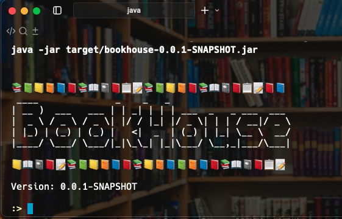
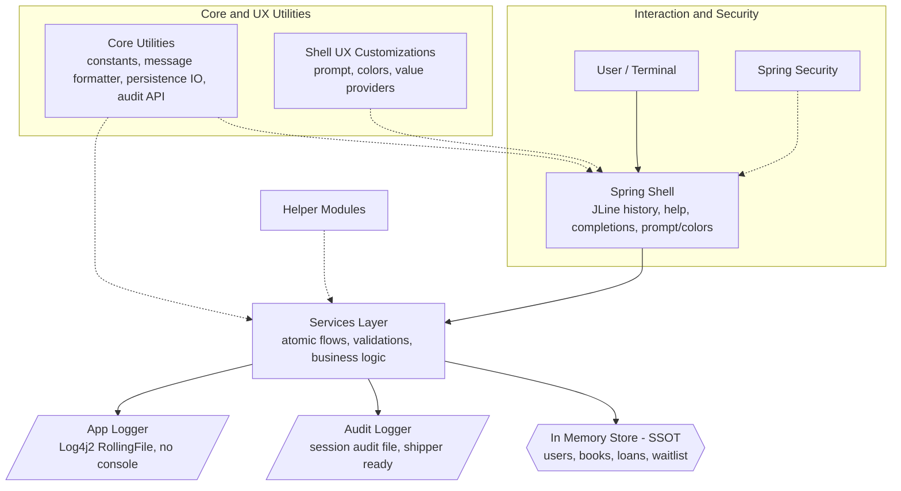

# Bookhouse CLI – Technical Design & Architecture

> **Audience:** Reviewers and engineers  
> **Document Type:** Technical design & Architecture Document 
> **Project Name:** `bookhouse` (interactive library management CLI)  
> **Contact:** cv.ranjith@gmail.com
---

## 1) Purpose & Context

The **Bookhouse CLI** is a small but production-minded interactive shell application for basic library management flows: managing users and books, borrowing/returning, waitlists, and reports. The original assignment was intentionally small, but the implementation demonstrates **clean modular structure**, **security (RBAC)**, **auditability**, **externalized configuration & i18n-readiness**, **sane data consistency (Single Source of Truth)**, and a **pleasant REPL UX** via Spring Shell. Where appropriate, forward-looking placeholders (e.g., **MCP/LLM** integration) are included to emphasize extensibility.

---

## 2) Requirements Overview

The task is to develop a **Command Line Interface (CLI)** that simulates the interaction of users with a small library system.  
Users must be able to log in, borrow and return books, view their borrowed books and waitlists, and manage accounts.  

Key points:

- Application is launched via `start.sh` in a fully provisioned environment
- Each run of `start.sh` must create a **fresh environment** — no persisted state across runs.  
- A minimum set of commands must be implemented (`login`, `add`, `list`, `borrow`, `return`, `waitlist`, `status`, `logout`).  
- Console output must match the required semantics, with flexibility to add additional enhancements.  
- Sample sessions were provided to illustrate expected behaviors (admin adding books, users borrowing, waitlisting, resolving waitlists when books are returned).  

---

## Core Commands (from requirement.md)

- **`login [name]`** — Logs in as a user, creates the user if not existing.  
- **`add [book_name]`** — Add a new book (admin only).  
- **`list`** — List all books and their availability.  
- **`borrow [book_name]`** — Borrow a book if available.  
- **`return [book_name]`** — Return a borrowed book.  
- **`waitlist [book_name]`** — Add the current user to waitlist if book unavailable.  
- **`status`** — Display borrowed books and waitlists of the logged-in user.  
- **`logout`** — Logout current user.  

---

## Requirement Matrix

| Req ID | Requirement | Description (from `requirements.md`) | Implemented in Bookhouse CLI |
|--------|-------------|---------------------------------------|-------------------------------|
| R1 | Fresh Start | Each run of `start.sh` resets state (no persisted users/books). | **Yes** — in-memory model; no persistence between runs. |
| R2 | User Login | `login [name]` creates/logs in user. | **Yes** — Auth module, RBAC aware. |
| R3 | Admin Add | `add [book]` only by `admin`. | **Yes** — Enforced via Spring Security role check. Please note command in bookhouse CLI is `add-book <bookId>`. |
| R4 | List Books | `list` shows books and status. | **Yes** — implemented with tabular, colorized UX. |
| R5 | Borrow Book | `borrow [book]` marks as borrowed. | **Yes** — atomic service flow. |
| R6 | Return Book | `return [book]` returns loan. | **Yes** — return by bookId or loanId supported. |
| R7 | Waitlist | `waitlist [book]` adds to queue. | **Yes** — implemented with FIFO; auto-notify. |
| R8 | Status | `status` shows loans/waitlists for user. | **Yes** — combined view implemented. |
| R9 | Logout | `logout` ends session. | **Yes** — resets shell prompt to guest. |

---

## Notes

- The Bookhouse CLI not only meets these base requirements, but also extends them with additional features:  
  - **Copies of books** (realistic multi-copy model).  
  - **Waitlist auto-cancel** when user borrows a previously waitlisted book.  
  - **Audit logs** and **application logging**.  
  - **Reports framework**.  
  - **RBAC enforcement** using Spring Security (instead of name check).  
  - **Enhanced UX** (color, Unicode, bold placeholders).  
  - **Future enhancements** like MCP/LLM integration.  

---

## 3) Architecture Overview

### 3.1 High-Level Flow

```
User (Terminal)
    │
    ▼
Spring Shell (Commands; help/completions/prompt/colors; JLine history)  ◀── (Spring Security)
    │
    ▼
Services (business logic; validations; atomic flows) ◀── (Helper Modules)
    │
    ▼
In-memory Store (SSOT: users, books, loans, waitlist — flat collections)
    │
    ├─► Audit Logger (File Store → session/audit file; log-shipper-ready)
    └─► App Logger (Log4j2 RollingFile; no console logs; log-shipper-ready)
```



### 3.2 Module / Package Layout

- `com.bookhouse.commands` — **Gateway** to shell commands (API). Separate files per domain for granularity:
  - `AdminCommands`, `BookHouseCommands`, `AuthCommands`.
- `com.bookhouse.service` — **Business services** (`AuthService`, `UserService`, `BookService`). Transactional/atomic flows live here.
- `com.bookhouse.models` — **Data modeling** classes (`User`, `Book`, `Loan`, `Waitlist`, `Result`, etc.).
- `com.bookhouse.security` — **Spring Security** config; role mapping; availability.
- `com.bookhouse.shell` — **Spring Shell UX customizations** (prompt with current user, color helpers, value providers).
- `com.bookhouse.core` — **Utilities** (global constants, print util, message formatter, audit logger, persistence IO helpers).

---

## 4) Technology Considerations

### 4.1 Stack & Rationale

- **Spring Boot**: Mature, lightweight bootstrap; dependency injection; auto-config; testing support; easy maintenance; best practices friendly.
- **Spring Shell**: Out-of-the-box interactive shell, **help**, **auto-completion**, **history**, **colors**, **prompt customization**, **command availability**, **input validation**, **aliases** — avoids reinventing a REPL.
  - **Custom prompt** shows **current logged-in user** for context: e.g., `alice:> `.
- **Spring Security**: Authentication/Authorization with **RBAC**; clean separation using annotations; no ad-hoc/hand-written checks.
- **Maven**: Standardized build, dependency management; easy CI integration.
- **Minimal dependencies**: Spring Boot + Spring Shell + Spring Security + Log4j2 (and test libs).
- **GraalVM Native** (optional): Smaller footprint, fast startup if needed; enabled via build plugin and Spring AOT.

---

## 5) Data Model & Single Source of Truth (SSOT)

### 5.1 Entities (in-memory, flat collections)

- `User(id, username, roles)`  
- `Book(id, title, author, totalCopies, availableCopies...)`  
- `Loan(id, userId, bookId, borrowedAt...)`  
- `Waitlist(id, userId, bookId, position, createdAt)`

> Implemented as **arrays/lists/maps** in memory; **no secondary in-memory indexes**.

### 5.2 SSOT Rationale

- **Always-consistent** single data source; avoids dual writes and drift.
- **Atomic operations** within service methods to keep state coherent (e.g., borrow updates availableCopies + creates Loan + cancels waitlist entry if applicable, in one unit).
- **Failsafe/rollback-safe** by ordering operations and performing validations upfront; on failure, state is unchanged.

### 5.3 Future Persistence

- When scale demands, **migrate to an external DB** and leverage **DB-native indexes/materialized views** — avoid DIY performance hacks.
- SSOT principle remains: the **DB** becomes the single truth.

### 5.4 Retrieval Strategy (Streams)

- All queries use **Java Streams** over the collections for **clear, efficient** filtering/sorting/mapping.
- Example:
```java
  List<Loan> matches = loans.values().stream()
          .filter(l -> Objects.equals(l.getUserId(), Global.userId()))
          .filter(l -> Objects.equals(l.getBookId(), bookId))
          .collect(Collectors.toList());
```

---

## 6) Security (Authentication & Authorization)

### 6.1 RBAC

- Roles: `ADMIN`, `USER` (extensible).
- **Checks** are **role-based** via Spring Security annotations — not by user-id string parsing.
- **Seeding** approach: for demo convenience, users whose IDs start with `admin*` are **seeded** with `ROLE_ADMIN`; all checks still rely on roles.

### 6.2 Access Policy

- **ADMIN only**: administrative commands — e.g., `add-book`.
- **Authenticated users**: `borrow`, `return`, `waitlist`.
- **Public**: `whoami` (shows guest or user), `list` (public can search the available books, but would require an account to borrow).

### 6.3 Annotation Examples

```java
  @PreAuthorize("hasRole('ADMIN')")
  @ShellMethod(key = "add-book", value = "Add a book. Usage: add-book <bookId> [--copies <n>]")
  public String addBook(
          @ShellOption(help = "Book id") String bookId,
          @ShellOption(help = "Number of copies", defaultValue = "1") Integer copies) {...)

  @PreAuthorize("isAuthenticated()")
  @ShellMethod(key = "borrow", value = "Borrow a book. Usage: borrow <bookId>")
  public String borrowBook(
          @ShellOption(help = "Book ID") String bookId) {...}

  @PreAuthorize("permitAll()")
  public String whoami() { … }
```

---

## 7) Commands & RBAC Matrix

| Command | Synopsis | Access | Notes |
|---|---|---|---|
| `login` | Log in | Public | Sets principal; updates prompt |
| `whoami` | Show current user | Public | Reflects in prompt |
| `list` | List books | Public | Wildcards for IDs/fields |
| `add-book` | Add book/copies | ADMIN | Copies default to 1; cumulative |
| `borrow` | Borrow | USER | Auto-cancel waitlist if exists |
| `return` | Return | USER | Flexible; future multi-book by loanId |
| `waitlist` | Add to waitlist | USER | If available, notify immediately |
| `cancel-waitlist` | Cancel waitlist | USER | Explicit cancel supported |
| `status` `watilist-status` `loan-satus` | Status Reports| USER/ADMIN | ADMIN=all; USER=self |
| `exit` | Exit shell | Public | Persist audit entry |

---

## 8) Reports Framework

- **Consistent framework** for tabular outputs; helper methods unify headers, widths, alignment.
- **RBAC-aware**: ADMIN sees all; USER only sees their own records
- **Wildcards**: `*` or partials match user IDs or book IDs for easy filters.
- **Extensible**: New reports follow the same pattern (registration + service-provided rows).

---

## 9) UX Considerations (Spring Shell + JLine)

- **Help**: auto-generated command list; command-level & argument-level help.
- **Auto-completion**: based on command names and custom **ValueProviders** (e.g., known book IDs).
- **Colorized outputs**: ANSI styles for headers/success/warnings/errors.
- **Prompt customization**: shows **current user**: E.g. `alice>`.
- **History navigation**: **Up/Down arrows** (JLine history).
- **Aliases** & **short options**: friendly syntax.
- **Friendly errors**: technical stack traces stay in logs; users see clean messages.
- **Branding**: `banner.txt` (supports Unicode) and externalized prompt/header strings.
- **Optional parameters**: e.g., return by **bookId** or **loanId**.
- **Highlighted variables**: message formatter **bolds** dynamic `{0}`, `{1}`, … placeholders for visibility.
- **Icons/Unicode**: permitted in messages for emphasis.


---

## 10) Core Functional Features

Refer to User Manual for the full feature support

### 10.1 Books with Copies
- `add-book` adds a new book or **tops up copies**; if `copies` absent, defaults to **1**.

### 10.2 Borrow/Return
- **Borrow** (`borrow --bookId`): decrements `availableCopies`, creates `Loan(borrowedAt=now)`.
- **Return** (`return --bookId` or `--loanId`): increments `availableCopies`.
- Friendly flexibility: return by loan ID or by book ID.

### 10.3 Waitlist Behavior
- **Auto-notify**: If a waitlisted book becomes available, the shell immediately displays a message: “Your waitlisted book `<id>` is now available; you can borrow it.” This also appears on login/prompt refresh until actioned.
- **Auto-cancel**: When a user borrows a book they had waitlisted, the relevant waitlist entry is **removed** automatically.
- **Manual cancel**: `cancel-waitlist --bookId`.

### 10.4 Availability Calculation
- A book is **available** if `availableCopies > 0`. Priority for waitlisted users is based on **queue position**. When copies free up, the earliest waitlist entries are next in line.

### 10.5 Loan Details
- Loans record **borrowed date**. This supports future **reminders/collections**.

### 10.6 Reports
- `status` `loan-status` `waitlist-status` prints tabular rows, with headings and totals; **wildcard** filters supported.
- ADMIN can query all; USER sees own by default.

---

## 11) Observability / Logging / Audit

### 11.1 Log4j2 App Logging
- **File-only** logging: terminal output remains clean. No `ConsoleAppender`.
- **RollingFile** policy for size/time rotation.
- `bookhouse.log` includes command invocations and errors (including **invalid/unknown commands** captured by a global handler).

### 11.2 Audit Log
- Every **activity** is written to a dedicated **audit** file (e.g., `audit.log`).
- Fields: timestamp, user-id, command, status, message ; **PII masking** can be added later if required.
- Design is **shipper-friendly** (Filebeat/Fluent Bit) with no code changes — configure a shipper to forward.

---

## 12) Externalized Configuration

- Refer to User Manual for the full feature details
- **Messages** in `messages.properties` so admins can edit **without recompiling**.
- Easy **multi-lingual** support by adding locale variants: E.g. `messages_fr.properties` 
- Spring **Environment**: `application.yaml/properties` for environment values injection.
- **Branding** via external `banner.txt` (Unicode supported).

### 12.1 Result Object & Message Codes

All Service handlers return a **`Result<T>`** with:
- `success: boolean`
- `code: String` (message code like `book.add.ok`)
- `params: Object[]` (message parameters `{0}`, `{1}` …)

This enables:
- **Unit tests to assert on `Result`** rather than grepping text.
- Final user-facing output assembled from **externalized messages**.
- Auto **Bolding** / **Highlighting** of dynamic values via a message renderer that wraps parameters with ANSI **bold** escape codes.


---

## 13) Coding Standards & Static Analysis

- **Visibility discipline**: no unnecessary `public` API; prefer package-private for internal utilities.
- **Consistent naming** and small methods.
- **Linter/static analysis** warnings addressed.
- **Null-safety**: clear contracts; `Optional` where appropriate; guard clauses.
- **Exceptions**: map to `Result` error codes; no stack traces to console.
- **Tests**: cover core logic and error paths.
- **Immutability** where viable for models; defensive copies.
- **Logs**: structured, succinct.

---

## 14) Testing Strategy

### 14.1 Unit Tests (Shift-Left)
- JUnit 5; Mockito as needed.
- Cover: validation, business logics.
- Tests assert on **`Result`** success/failure flags & message codes/params.

**Example:**
```bash
./mvnw test
```

### 14.2 Integration Tests (Interactive Shell)
- **Simple Bash script** for smoke & assertions (portable; no heavy frameworks).
- Location: `test/cli/integration-test.sh`.
- Emulates terminal input, captures output, **grep** assertions.
- Can be wired in CI after packaging

**Example:**
```bash
sh src/test/cli/integration-test.sh
```

---

## 15) Build, Packaging, Run & Native

- **Build**: Maven + Spring Boot plugin → **fat JAR** (`bookhouse.jar`).
- **Run**: `java -jar bookhouse-0.0.1-SNAPSHOT.jar`
- **Native** (optional): `mvn -Pnative native:compile` with GraalVM & Spring AOT (start fast, small footprint).

### 15.1 Sample `application.properties`

```yaml
spring.application.name=bookhouse
spring.main.web-application-type=none
spring.shell.interactive.enabled=true
spring.shell.noninteractive.enabled=false


# file logging
logging.file.name=logs/application.log

# turn off console output entirely; keep file at INFO+
logging.threshold.console=OFF
logging.threshold.file=INFO

# rolling policy (Logback)
logging.logback.rollingpolicy.file-name-pattern=logs/application-%d{yyyy-MM-dd}.%i.log
logging.logback.rollingpolicy.max-file-size=100MB
logging.logback.rollingpolicy.max-history=14
logging.logback.rollingpolicy.total-size-cap=1GB
```

### 15.2 Dockerfile
The application can be containerized. Sample Dockerfile supplied in the repo.

---

## 16) Observability & Error Handling Behavior

- User sees **clean**, friendly messages; **no** stack traces.
- Technical Details of the Errors go to `application.log`.

---

## 17) Future Enhancements & Roadmap

### 17.1 MCP / LLM Integration (COMING SOON)
- Placeholder argument `--mcp` prints a banner **“AI/MCP integration coming soon.”**
- Provider SPI: `AiClient` interface (no-op default). Later implementation can integrate with LLM via MCP

#### Example

```text
java -jar target/bookhouse-0.0.1-SNAPSHOT.jar --mcp
✨ MCP/LLM features coming soon... stay tuned! ✨


📚📗📒📙📘📕📚📖📓📕📋📝📚📗📒📙📕📚📖📓📕📋📝📕📘
 ____              _    _   _                      
| __ )  ___   ___ | | _| | | | ___  _   _ ___  ___ 
|  _ \ / _ \ / _ \| |/ / |_| |/ _ \| | | / __|/ _ \
| |_) | (_) | (_) |   <|  _  | (_) | |_| \__ \  __/
|____/ \___/ \___/|_|\_\_| |_|\___/ \__,_|___/\___|

📒📖📓📕📝📚📗📒📙📘📕📚📒📙📘📗📙📘📕📚📖📓📕📋📝
```

### 17.2 Persistence
- Swap in a relational or document DB; keep SSOT; leverage **indexes** and **materialized views** in DB.

### 17.3 Notifications
- Optional hooks to email/Slack when waitlisted items become available.

### 17.4 Advanced UX
- More completions (user/book IDs), fuzzy finders, theming, accessibility tweaks.

---

## 18) Risks & Trade-offs

- **Spring for CLI** -> increases footprint slightly but gives **DI, testability, security, and rich UX** quickly.
- **No in-memory indexes** -> acceptable at current scale; future DB migration planned.
- **Interactive tests** can vary by OS; mitigated with simple Bash and CI containers.

---

## 19) Submission Checklist

- [x] Base requirements implemented; mapping prepared.  
- [x] Commands structured under Spring Shell; help & completions working.  
- [x] Services encapsulate logic; SSOT in-memory model; Streams-based queries.  
- [x] Audit trail for all commands (session log).  
- [x] Application logging to **file-only**; clean terminal.  
- [x] RBAC with Spring Security; annotation-driven checks.  
- [x] Externalized messages; banner branding.  
- [x] Unit tests for core services & flows; `Result` asserts.  
- [x] Integration test (`sh src/test/cli/integration-test.sh`).
- [x] Reports framework (tabular, wildcards, RBAC-aware).  
- [x] MCP/LLM placeholder command.  
- [x] User Manual added to repo.
- [x] This design document added to repo.

---

## 20) Conclusion

Bookhouse demonstrates a **clean, maintainable** CLI with **proper RBAC**, **traceability**, and **extensibility** beyond the minimum assignment. It intentionally avoids premature complexity (no secondary in-memory indexes) while providing a **migration path** to a database. UX is pleasant and consistent thanks to Spring Shell, and testing includes both **unit** and **interactive** integration coverage. The project is ready for review and future evolution (MCP, persistence, notifications).
