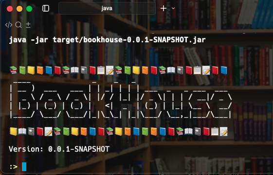
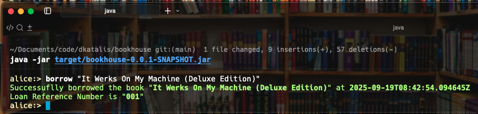

```text
📚📗📒📙📘📕📚📖📓📕📋📝📚📗📒📙📕📚📖📓📕📋📝📕📘
 ____              _    _   _                      
| __ )  ___   ___ | | _| | | | ___  _   _ ___  ___ 
|  _ \ / _ \ / _ \| |/ / |_| |/ _ \| | | / __|/ _ \
| |_) | (_) | (_) |   <|  _  | (_) | |_| \__ \  __/
|____/ \___/ \___/|_|\_\_| |_|\___/ \__,_|___/\___|

📒📖📓📕📝📚📗📒📙📘📕📚📒📙📘📗📙📘📕📚📖📓📕📋📝
```

# Bookhouse CLI — User Manual

> **Version:** 1.0  
> **Audience:** End users and reviewers  
> **Scope:** Daily usage of the Bookhouse interactive CLI (login, list, borrow, return, waitlist, status, admin add-book), plus built-in shell features.

---

## Table of Contents

- [1. About Bookhouse](#1-about-bookhouse)
- [2. Quick Start](#2-quick-start)
- [3. Authentication & Roles](#3-authentication--roles)
- [4. Using the Interactive Shell](#4-using-the-interactive-shell)
- [5. Concepts](#5-concepts)
- [6. Command Reference](#6-command-reference)
  - [6.1 Admin Commands](#61-admin-commands)
  - [6.2 Auth Commands](#62-auth-commands)
  - [6.3 Book House Commands](#63-book-house-commands)
  - [6.4 Built-in Shell Commands](#64-built-in-shell-commands)
- [7. Configuration](#7-configuration)
- [8. Logs & Audit](#8-logs--audit)
- [9. Troubleshooting](#9-troubleshooting)
- [10. FAQ](#10-faq)
- [Appendix A: Sample Script File](#appendix-a-sample-script-file)

---

## 1. About Bookhouse

**Bookhouse** is an interactive command-line application for managing a small library: list books, borrow/return, join/cancel waitlists, and view loan/waitlist status. It includes role-based access control (RBAC) so **admins** can manage books and **users** can perform typical borrower tasks.

### Highlights

- Friendly interactive shell with **help**, **auto-completion**, **colors**, and **history**.  
- **Login-aware prompt** (shows current user).  
- **RBAC**: Admin-only vs authenticated-user features.  
- Clean terminal output; errors are summarized (full stacktraces available on demand).  
- Structured **audit log** and file-based **application logs** (for support/debugging).

---

## 2. Quick Start

### Prerequisites
- Java 17+ (or a native image if provided/Alternatively using a Docker container).
- The packaged JAR, e.g. `bookhouse.jar`.

### Launch
```bash
java -jar target/bookhouse-0.0.1-SNAPSHOT.jar
```
> The shell starts and displays a banner and prompt `>`.

**Example output:**



### First Steps
```text
help            # show all commands
login alice     # authenticate as user "alice"
whoami          # confirm the current user
list BK-1001    # view a book by id
exit            # leave the shell
```

**Example login command :**
```text
:> help
AVAILABLE COMMANDS

Admin Commands
       add-book: Add a book. Usage: add-book <bookId> [--copies <n>]

Auth Commands
       logout: Logout the current user.
       login: Login with a user id. Usage: login <userId>

Book House Commands
       whoami: Returns the current User ID
       loan-status: Print Loan Status. Usage: loan-status [<userId>]
       waitlist-status: Print Waitlist Status. Usage: waitlist-status [<userId>]
       waitlist: Join waitlist. Usage: waitlist <bookId>
       borrow: Borrow a book. Usage: borrow <bookId>
       list: List books. Usage: list <bookId>
       cancel-waitlist: Cancel waitlist. Usage: cancel-waitlist <bookId>
       return: Return a book by book ID or loan ID.
       Usage:
         return-book --book <bookId>
         return-book --loan <loanId>
       status: Print Status of Loans and Waitlists. Usage: status [<userId>]

Built-In Commands
       help: Display help about available commands
       stacktrace: Display the full stacktrace of the last error.
       clear: Clear the shell screen.
       quit, exit: Exit the shell.
       history: Display or save the history of previously run commands
       version: Show version info
       script: Read and execute commands from a file.
```
---

## 3. Authentication & Roles

- **Public** (no login): You can run non-sensitive commands (e.g., `help`, `whoami`, `list` depending on configuration).  
- **User**: After `login <userId>`, you can **borrow**, **return**, **join/cancel waitlist**, and view **status**.  
- **Admin**: Admins can also **add books** (and other admin-only actions if enabled).

> **Prompt**: The shell prompt shows the current user, e.g. `alice>`. After `logout`, it returns to `>`.

**Example :**


---

## 4. Using the Interactive Shell

- **Help**: `help` and `help <command>` list commands and usage.  
- **Auto-completion**: Press `Tab` to complete commands and options (where supported).  
- **History**: Use **Up/Down** arrows to navigate previously entered commands.  
- **Colors & Formatting**: Some outputs (headings, emphasis) are colorized or emboldened for readability.  
- **Clear screen**: `clear`.  
- **Run a script**: `script <file>` executes commands from a file line-by-line.

**Example :**
```text
:> help add-book
NAME
       add-book - Add a book. Usage: add-book <bookId> [--copies <n>]

SYNOPSIS
       add-book [--bookId String] --copies Integer --help 

OPTIONS
       --bookId String
       Book id
       [Mandatory]

       --copies Integer
       Number of copies
       [Optional, default = 1]

       --help or -h 
       help for add-book
       [Optional]

```

---

## 5. Concepts

- **Book**: Identified by `<bookId>`. Admins can add books and specify **copies**.  
- **Copies**: A book can have multiple copies. Borrowing decrements **available copies**; returning increments them.  
- **Loan**: Represents a user borrowing a specific book. Identified by `<loanId>`.  
- **Waitlist**: Queue of users waiting for a book when **no copies** are available.  
- **Status**: Summary view(s) of **loans** and **waitlists** for a user (or for all users, if admin).

---

## 6. Command Reference

Below is the command list as shown by `help`, grouped by category. Each command entry includes **syntax**, **description**, **permissions**, and a placeholder for **examples**.

### 6.1 Admin Commands

#### `add-book`
- **Description:** Add a new book or add more copies to an existing book.  
- **Usage:**  
  ```text
  add-book <bookId> [--copies <n>]
  ```
- **Permissions:** `ADMIN` only.  
- **Notes:** If `--copies` is omitted, defaults to 1. Re-running adds (tops up) copies.
- **Notes:** use \\" for escaping quotes.
**Examples:**


---

### 6.2 Auth Commands

#### `login`
- **Description:** Log in as a specific user.  
- **Usage:**  
  ```text
  login <userId>
  ```
- **Permissions:** Public.  
- **Notes:** Prompt updates to show current user.

**Examples:**


#### `logout`
- **Description:** Log out the current user.  
- **Usage:**  
  ```text
  logout
  ```
- **Permissions:** Public.  
- **Notes:** Returns to guest mode.

**Examples:**


---

### 6.3 Book House Commands

#### `whoami`
- **Description:** Show the current user ID (or `guest` if not logged in).  
- **Usage:**  
  ```text
  whoami
  ```
- **Permissions:** Public.

**Examples:**
```text
alice:> whoami
alice
alice:> 
```

#### `list`
- **Description:** List books (or view details for a specific `<bookId>`).  
- **Usage:**  
  ```text
  list <bookId>
  ```
- **Permissions:** Public (unless restricted by configuration).  
- **Tips:** Your build may support wildcard matching (e.g., `*`) depending on configuration.

**Examples:**


#### `borrow`
- **Description:** Borrow a book by `<bookId>`.  
- **Usage:**  
  ```text
  borrow <bookId>
  ```
- **Permissions:** Logged-in users.  
- **Behavior:**  
  - If a copy is available, a **loan** is created immediately.  
  - If unavailable, you may be guided to join the **waitlist**.

**Examples:**



#### `return` (alias: `return-book`)
- **Description:** Return a book by **book ID** or **loan ID**.  
- **Usage:**  
  ```text
  return-book --book <bookId>
  return-book --loan <loanId>
  ```
  > Some builds also accept `return` as an alias.
- **Permissions:** Logged-in users.  
- **Notes:** Returning by `loanId` is unambiguous when multiple books could share a loan group in the future.

**Examples:**


#### `waitlist`
- **Description:** Join the waitlist for a `<bookId>`.  
- **Usage:**  
  ```text
  waitlist <bookId>
  ```
- **Permissions:** Logged-in users.  
- **Behavior:** You are placed in a FIFO queue. If a copy becomes available, you’ll be notified in the shell.
- **Notes:** If the book is indeed available for you to borrow, we will display a friendly information. The same information will be displayed during login time as well.

**Examples:**


#### `cancel-waitlist`
- **Description:** Cancel your waitlist entry for `<bookId>`.  
- **Usage:**  
  ```text
  cancel-waitlist <bookId>
  ```
- **Permissions:** Logged-in users.

**Examples:**
```text
alice:> cancel-waitlist "It Werks On My Machine (Deluxe Edition)"
alice:> You have been removed from the waitlist for book "It Werks On My Machine (Deluxe Edition)"
```

#### `loan-status`
- **Description:** Print loan status for a user.  
- **Usage:**  
  ```text
  loan-status [<userId>]
  ```
- **Permissions:**  
  - Users: view their own (omit `<userId>`).  
  - Admins: can specify a `<userId>` to view others; some builds may allow `*` to view all.
- **Output:** Tabular summary of loans (book id, borrowed date, returned date, etc.).

**Examples:**
```text
alice:> loan-status
sl | User  | Loan Id | Book Id                                 | Borrowed On                
---+-------+---------+-----------------------------------------+----------------------------
1  | alice | 003     | It Werks On My Machine (Deluxe Edition) | 2025-08-28T14:21:19.134181Z
```

#### `waitlist-status`
- **Description:** Print waitlist status for a user.  
- **Usage:**  
  ```text
  waitlist-status [<userId>]
  ```
- **Permissions:** Same as `loan-status`.  
- **Output:** Tabular summary of waitlist entries (book id, position, joined date).

**Examples:**
```text
alice:> waitlist-status 
sl | User  | Book Id                                 | Position | Added On                   
---+-------+-----------------------------------------+----------+----------------------------
1  | alice | It Werks On My Machine (Deluxe Edition) | 1        | 2025-08-28T14:21:54.116722Z
```

#### `status`
- **Description:** Combined view of **loans and waitlists** for a user.  
- **Usage:**  
  ```text
  status [<userId>]
  ```
- **Permissions:** Same as `loan-status`.  
- **Output:** Summary blocks for **Loans** and **Waitlist**.
- **Tip:** Admin can see status of any user
           Admin can also query using wildcards E.g. `status ali*`
**Examples:**
```text
alice:> status
 Your Loan Status:
sl | User  | Loan Id | Book Id                                 | Borrowed On                
---+-------+---------+-----------------------------------------+----------------------------
1  | alice | 003     | It Werks On My Machine (Deluxe Edition) | 2025-08-28T14:21:19.134181Z

 Your Waitlist Status:
sl | User  | Book Id                                 | Position | Added On                   
---+-------+-----------------------------------------+----------+----------------------------
1  | alice | It Werks On My Machine (Deluxe Edition) | 1        | 2025-08-28T14:21:54.116722Z


admin:> status ali*
 Your Loan Status:
sl | User  | Loan Id | Book Id                                 | Borrowed On                
---+-------+---------+-----------------------------------------+----------------------------
1  | alice | 003     | It Werks On My Machine (Deluxe Edition) | 2025-08-28T14:21:19.134181Z

 Your Waitlist Status:
sl | User  | Book Id                                 | Position | Added On                   
---+-------+-----------------------------------------+----------+----------------------------
1  | alice | It Werks On My Machine (Deluxe Edition) | 1        | 2025-08-28T14:21:54.116722Z
```

---

### 6.4 Built-in Shell Commands

These are provided by the underlying shell to improve usability.

#### `help`
- **Description:** Display help for all commands, or detailed help for a specific command.  
- **Usage:**  
  ```text
  help
  help <command>
  ```

**Examples:**
```text
admin:> help add-book
NAME
       add-book - Add a book. Usage: add-book <bookId> [--copies <n>]

SYNOPSIS
       add-book [--bookId String] --copies Integer --help 

OPTIONS
       --bookId String
       Book id
       [Mandatory]

       --copies Integer
       Number of copies
       [Optional, default = 1]

       --help or -h 
       help for add-book
       [Optional]
```

#### `history`
- **Description:** Show or save the command history.  
- **Usage:**  
  ```text
  history
  history --file <path>
  ```

**Examples:**
admin:> history 
[status, logout, exit,...
...
...]
```

#### `script`
- **Description:** Read and execute commands from a file.  
- **Usage:**  
  ```text
  script <file>
  ```

**Examples:**
```text
script /path/to/demo.script
```

#### `clear`
- **Description:** Clear the terminal screen.  
- **Usage:**  
  ```text
  clear
  ```

**Examples:**
```text
clear
```

#### `version`
- **Description:** Show version information.  
- **Usage:**  
  ```text
  version
  ```

**Examples:**
```text
version
```

#### `stacktrace`
- **Description:** Display the full stacktrace of the last error (for debugging).  
- **Usage:**  
  ```text
  stacktrace
  ```
- **Notes:** By design, normal errors are summarized; the full stacktrace is hidden unless explicitly requested.

**Examples:**
```text
admin:> stacktrace 
java.lang.IllegalArgumentException: Unknown command 'add-books'
	at org.springframework.shell.standard.commands.Help.renderCommand(Help.java:141)stacktrace
  ...
```

#### `quit`, `exit`
- **Description:** Exit the shell.  
- **Usage:**  
  ```text
  quit
  exit
  ```

**Examples:**
```text
quit
```

---

## 7. Configuration

Most deployments can run with sensible defaults. Some builds may expose the following configurations:

### Bookhouse CLI — Configurability Sections

> This excerpt is designed to be **inserted into the User Manual**. It focuses only on **configurability**: message text, banner branding, and application properties.

---

### 7.1 Message Text Customization (`messages.properties`)

System administrators can customize **all user-facing text** without changing source code by editing `messages.properties`.  
You can:
- Change wording, tone, and **insert Unicode icons/emojis**.
- Use **message parameters** `{0}`, `{1}`, … which are filled at runtime.
- Use **style markers** like `[[BOLD]]`, `[[CYAN]]`, `[[YELLOW]]`, `[[RESET]]` (these are mapped to ANSI styles by the CLI renderer).
- Add **new languages** by creating locale files such as `messages_fr.properties`, `messages_es.properties`, etc. At runtime, the appropriate bundle can be selected by Spring’s message resolution (or by your configured locale strategy).

**File location (typical):**
- `src/main/resources/messages.properties` (packaged default)
- Or externalized on the classpath / config path if you prefer ops-driven overrides

**Examples:**
```properties
# Auth Service messages
login.success= 👋 Welcome, [[BOLD]][[CYAN]]{0}[[RESET]]! You are now logged In
logged.out= 🚪 Good Bye, [[BOLD]][[YELLOW]]{0}[[RESET]]!
login.first=🔑 This is your first login
login.last=📅 Your last login was at {0}
admin.login=🛡️ You are an [[BOLD]]ADMIN[[RESET]] user!
already.loggedin=😉 Nothing to do. You are already logged in as: {0}

book.added=📙 Added {0} copies of "{1}". Total now: {2}.
loan.return.ok=✅ Returned book "{0}" (loanId: {1}).
```


---

### 7.2 Branding the Shell Banner (`banner.txt`)

Customize the startup banner to align with your **brand** or environment. `banner.txt` supports **Unicode** and Spring placeholders such as `${application.version}`.

**File location (typical):** `src/main/resources/banner.txt`

**Default banner:**
```
📚📗📒📙📘📕📚📖📓📕📋📝📚📗📒📙📕📚📖📓📕📋📝📕📘
 ____              _    _   _                      
| __ )  ___   ___ | | _| | | | ___  _   _ ___  ___ 
|  _ \ / _ \ / _ \| |/ / |_| |/ _ \| | | / __|/ _ \
| |_) | (_) | (_) |   <|  _  | (_) | |_| \__ \  __/
|____/ \___/ \___/|_|\_\_| |_|\___/ \__,_|___/\___|

📒📖📓📕📝📚📗📒📙📘📕📚📒📙📘📗📙📘📕📚📖📓📕📋📝

Version: ${application.version}
```


---

##$ 7.3 Application Properties (Logging & More)

Any standard **Spring Boot** property can be customized via `application.properties` or `application.yml`.  
Below is your logging example (Spring Boot **Logback** keys). If you’re using Log4j2, prefer `log4j2.xml` (see the design doc) and adjust accordingly.

**Example (`application.properties`):**
```properties
# file logging
logging.file.name=logs/bookhouse.log

# turn off console output entirely; keep file at INFO+
logging.threshold.console=OFF
logging.threshold.file=INFO

# rolling policy (Logback)
logging.logback.rollingpolicy.file-name-pattern=logs/bookhouse-%d{yyyy-MM-dd}.%i.log
logging.logback.rollingpolicy.max-file-size=100MB
logging.logback.rollingpolicy.max-history=14
logging.logback.rollingpolicy.total-size-cap=1GB
```

**Notes:**
- If you’ve switched to **Log4j2**, the rolling strategy is configured in `log4j2.xml` instead (appender + policies).  
- You can also externalize other Spring variables (e.g., prompt pattern, paths, feature toggles) in `application.yml` or environment variables.

> **Where to show it:**  
> Paste current property values or diffs here to illustrate how your deployment differs from defaults.


---

## 8. Logs & Audit

- **Application log** (e.g., `./bookhouse.log`): Operational messages and errors.  
- **Audit log** (e.g., `./audit.log`): Each command execution with timestamp, user, command, status, and summary.  
- Logs are file-based to keep the shell output clean; they can be shipped to external log systems if needed.

**Example log entries:**
```text
2025-08-28T21:16:27.372+08:00  INFO 54564 --- [bookhouse] [main] com.cvr.bookhouse.BookhouseApplication   : Starting BookhouseApplication using Java 17.0.16 with PID 54564 (/Users/ranjithcv/Documents/code/dkatalis/bookhouse/target/classes started by ranjithcv in /Users/ranjithcv/Documents/code/dkatalis/bookhouse)
2025-08-28T21:16:27.373+08:00  INFO 54564 --- [bookhouse] [main] com.cvr.bookhouse.BookhouseApplication   : No active profile set, falling back to 1 default profile: "default"
2025-08-28T21:16:27.843+08:00  INFO 54564 --- [bookhouse] [main] com.cvr.bookhouse.BookhouseApplication   : Started BookhouseApplication in 0.629 seconds (process running for 0.739)
2025-08-28T21:16:41.093+08:00  INFO 54564 --- [bookhouse] [main] c.cvr.bookhouse.commands.AdminCommands   : addBook bookId,copies = 1001,20
2025-08-28T21:29:04.564+08:00  INFO 60879 --- [bookhouse] [main] com.cvr.bookhouse.BookhouseApplication   : Starting BookhouseApplication v0.0.1-SNAPSHOT using Java 17.0.16 with PID 60879 (/Users/ranjithcv/Documents/code/dkatalis/bookhouse/target/bookhouse-0.0.1-SNAPSHOT.jar started by ranjithcv in /Users/ranjithcv/Documents/code/dkatalis/bookhouse)
2025-08-28T21:29:04.565+08:00  INFO 60879 --- [bookhouse] [main] com.cvr.bookhouse.BookhouseApplication   : No active profile set, falling back to 1 default profile: "default"
2025-08-28T21:29:05.067+08:00  INFO 60879 --- [bookhouse] [main] com.cvr.bookhouse.BookhouseApplication   : Started BookhouseApplication in 0.682 seconds (process running for 0.861)
2025-08-28T21:48:34.580+08:00  INFO 60879 --- [bookhouse] [main] c.cvr.bookhouse.commands.AdminCommands   : addBook bookId,copies = It Werks On My Machine (Deluxe Edition),1
2025-08-28T21:48:49.244+08:00  INFO 60879 --- [bookhouse] [main] c.cvr.bookhouse.commands.AdminCommands   : addBook bookId,copies = It Werks On My Machine (Deluxe Edition),10
2025-08-28T21:52:39.971+08:00  INFO 60879 --- [bookhouse] [main] c.cvr.bookhouse.commands.AdminCommands   : addBook bookId,copies = The "Hello, World" Anthology (Deluxe Edition),1
```

---

## 9. Troubleshooting

- **“Command not found”** → Run `help` or `help <command>` for usage and spelling.  
- **“Not authorized” / “Access denied”** → Log in as a user with the correct role; admin-only commands require an admin account.  
- **“Book not found”** → Check the `<bookId>`; use `list <bookId>` to confirm.  
- **Cannot borrow** → No available copies; consider `waitlist <bookId>`.  
- **Return failing** → If you have multiple loans, use `return-book --loan <loanId>` for an exact match.  
- **Unexpected error** → Use `stacktrace` to display the last error details for debugging and share with support.

---

## 10. FAQ

- **Do I need to log in?**  
  You can run some public commands without logging in, but borrowing/returning/waitlisting requires login.

- **What’s the difference between `return-book --book` and `--loan`?**  
  `--book` is convenient; `--loan` is exact (useful when multiple loans exist).

- **Can I see someone else’s status?**  
  Only admins can view another user’s status; regular users can see their own.

- **Why don’t I see stacktraces?**  
  The CLI keeps the terminal clean. Use `stacktrace` to explicitly print the last error’s full details.

---

## Appendix A: Sample Script File

You can automate a demo or smoke test with `script <file>`. Example:

```text
# demo.script (example)
login admin01
add-book BK-2001 --copies 3
list BK-2001
logout
login alice
borrow BK-2001
status
exit
```


---

## Issues & Support

If you encounter any issues while using **Bookhouse CLI**, or have suggestions for improvements:

📧 Contact: cv.ranjith@gmail.com


When reporting an issue, please include:
- The command you were running  
- The exact error message or unexpected behavior
- Relevant excerpts from `./bookhouse.log` or `./session.log` or `./audit.log`

---
**Happy reading and have a smooth run with Bookhouse!**
